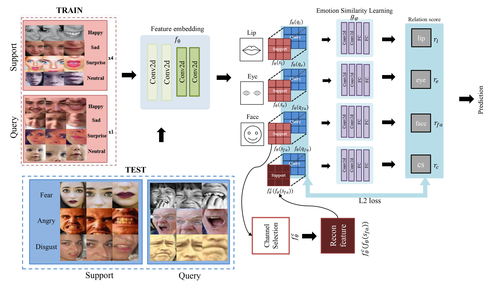

 Hello! My name is Chae-Lin Kim.
I am currently pursuing a Ph.D. in Computer Science at <a href="https://sse.tulane.edu/">Tulane University</a> advised by <a href="https://saadh.info/">Prof. Saad Hassan</a>, where I focus on AI-based assistive technology. My research interests include deep learning networks, particularly in the field of Human-Computer Interaction (HCI) and computer vision. I am passionate about developing technologies that enhance the quality of life.

I received both BS and MS in IT Engineering from Sookmyung Women's University.
 

<h2>Recent News</h2>
  <b>Our poster and demonstration work has been accepted to <b>ASSETS 2025</b>!

	  
<h2>Conference</h2>
<ul class="conference">

        <table>
		<tbody>
  			<tr>
			<td style="padding:20px;width:25%;vertical-align:middle">
			  
			</td>
			<td style="padding:20px;width:75%;vertical-align:middle">
			  <papertitle> <a href="https://arxiv.org/abs/2504.05857"> Towards an AI-Driven Video-Based American Sign Language Dictionary: Exploring Design and Usage Experience with Learners </a></papertitle>
			  	
			    Saad Hassan, Matyas Bohacek, Chaelin Kim, Denise Crochet
			    The 22nd International Web for All Conference (W4A 2025)

			</td>
			  </tr>    
  			<tr>
			<td style="padding:20px;width:25%;vertical-align:middle">
			  
			</td>
			<td style="padding:20px;width:75%;vertical-align:middle">
			  <papertitle> <a href="https://ieeexplore.ieee.org/abstract/document/10444505">Channel Selective Relation Network for Efficient Few-shot Facial Expression Recognition </a> </papertitle>
			  </a>		
			    <b>Chae-Lin Kim</b>, Ga-Eun Lee, Jiwoo Kang, Byung-Gyu Kim*
			    IEEE International Conference on Consumer Electronics (ICCE) 2024

			</td>
			</tr>   
		</tbody>
        </table>

</ul>

<h2>Journal</h2>
<ul class="journal">
	<li>HTML - Jade - Haml - Erb</li>
	<li>Responsive (Mobile First)</li>
	<li>CSS (Stylus, Sass, Less)</li>
</ul>

<h2>Skills</h2>
<ul class="skills">
	<li>Python</li>
</ul>

<h2>Projects</h2>

<ul>
	<li><a href="https://github.com/">Lorem Lorem</a></li>
	<li><a href="https://github.com/">Ipsum Dolor</a></li>
	<li><a href="https://github.com/">Dolor Lorem</a></li>
</ul>
